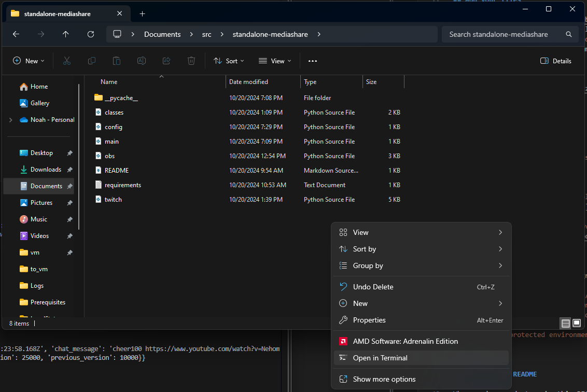

# Twitch MediaShare Python  

## Getting Started  
### Python  
Open a PowerShell windows and type the python3 command.  
If you have python3 installed, it should drop you into a python3 interpreter. Type "quit()" to exit and proceed to the next section.  

Otherwise, it should open the Windows store. Press install to install the latest version of python3.  

Install python dependencies:  
Right click the folder where you unzipped this project without selecting a file.  
Click "Open in terminal" from the presented options.  
  

In the terminal, type the following command:  
`python3 -m pip install -r requirements.txt`

### OBS:  
Tools -> WebSocket Server Settings -> Enable WebSocket Server  
Tools -> WebSocket Server Settings -> Enable authentication  
Tools -> WebSocket Server Settings -> Show Connect Info  
Copy the password to config.py into the field OBS_WEBSOCKET_PASSWORD  

Create a Browser Source and add it to a scene.  
Be sure to check the box in properties during creation to "Shutdown source when not visible"  
Put the name of the Browser Source into config.py as the field OBS_SCENEITEM_NAME

### Twitch:  
Every time you run the app you will be prompted through your default browser to authorize the script to run.  
When you periodically need to refresh your Twitch API Token, the browser will relaunch and, when available, use your cached token to renew itself.

### MediaShare:  
Modify config.py to ensure it has only valid values.  
App Token is specific to this app and should remain the same.  

## Running the app  
Running the app is simple provided the config file is valid.  

Follow the above steps for opening a PowerShell prompt in the current directory.  
In PowerShell:  
`python3 main.py`

## How it works  
### Twitch Thread
The app works by connecting to the Twitch PubSub WebSocket in one thread to receive incoming Bits donations. When a Bits donation above the TRIGGER_BIT_VALUE threshhold (defined in config.py) is received, the message associated with the donation is then parsed do determine if it contains a YouTube link for MediaShare.  

Provided the message contains a YouTube link, it is then parsed for up to 2 additional fields of start_time and end_time. The message can appear in any order, but the first number (or time such as 6:10 or 12:42:06) is used as the start_time for the video. If there is a second number, it is used as the end_time for the video. If the clip is too long, it is cut down to the correct length based on donation amount. If the end_time happens to fall before the full duration that was paid for, the video will stop at the requested end_time to allow for shorter clips with larger donations. In the event the end_time falls before the start_time, the end_time will be added to the start_time and the new value will be used to specify the new end_time. If neither a start_time or end_time is present, the video will begin at the beginning of the video and play for the duration that was paid for. Timestamps passed in the URL of the video (such as https://www.youtube.com/watch?v=whatever&t=1152) are only honored if a start_time is not specified.  

This sounds convoluted in nature, but in reality it's pretty simple. Examples of valid messages will be included in the examples section.  

Once parsing is completed, the video is checked to make sure the number of views on the video exceeds the MIN_VIEWS threshhold. If it passes this check, it is added to the queue and the Twitch thread continues listening.  

### OBS Thread  
The OBS Thread is spun up as needed and only exists while MediaShare requests are present in the queue.  

The OBS Thread will connect to the OBS WebSocket and attempt to find the correct browser source. It will then change the URL in the browser source to point to the new YouTube video, unmute and unhide the source so it begins to play, and then when the duration requested to run expires, hides the browser source effectively killing the video.  

The thread continues this loop until the queue is emptied, and then dies gracefully, closing the connection to the OBS WebSocket in the process.

## TODO
- Revisit the time parsing section.
- Figure out how to do chatbot things (!queue, !mediashare for usage, etc.)

## Considerations  
*How do I replay a video if I accidentally talked over it?*  
You don't. There's no way to replay anything using this script, you'll have to do it manually.  

*How can I access the list of videos that I played during my stream?*  
You can't. The data is non-persistent and gets deleted as soon as it is popped off the queue.  

*Can you make a nice web page as a landing zone to let me see everything in the queue and easily start/stop MediaShare?*  
No.  

*Some weird error came up or something just isn't working for me.*  
Email a screenshot and anything helpful you can add to support@maskarauder.com, I'll get to it when I can.

## Examples
These are all examples of valid inputs that should be supported:  

`cheer1000 https://www.youtube.com/watch?v=4jXEuIHY9ic 5 60`  
This will play the video starting at 5 seconds and ending 55 seconds later at the 60 seconds mark.  

`cheer1000 https://www.youtube.com/watch?v=4jXEuIHY9ic`  
This will play the video starting at 0 seconds and ending at the duration donated for.  

`cheer1000 https://www.youtube.com/watch?v=4jXEuIHY9ic&t=10s`  
This will play the video starting at 10 seconds and ending at the duration donated for.  

`cheer1000 https://www.youtube.com/watch?v=4jXEuIHY9ic 15`  
This will play the video starting at 15 seconds and ending at the duration donated for.  

`cheer1000 https://www.youtube.com/watch?v=4jXEuIHY9ic 1:15 1:30`  
This will play the video starting at offset 1:15 and ending 15 seconds later at the 1:30 mark.  

`cheer1000 https://www.youtube.com/watch?v=4jXEuIHY9ic 60 15`  
This will play the video starting at offset 1:00 and ending 15 seconds later at the 1:15 mark.  

`cheer1000 https://www.youtube.com/watch?v=4jXEuIHY9ic 1152 3:00`  
This will play the video starting at the 1152 seconds offset and ending 3 minutes later.  

`cheer1000 https://www.youtube.com/watch?v=4jXEuIHY9ic&t=10s 15`  
This will play the video starting at the 15 seconds offset and ending at the duration donated for. The t=10s in the URL is ignored.